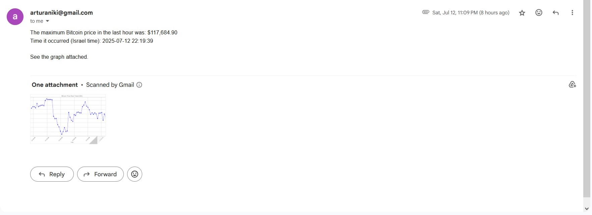

#  Bitcoin Price Tracker & Email Reporter

This project is a **Python-based automation tool** that monitors the real-time price of **Bitcoin (BTC)** for one hour, fetching data every minute via the **Coinbase API**.  

At the end of the tracking period, it:
- Stores all collected data in a structured JSON file
- Generates a price trend graph using `matplotlib`
- Sends an **automated email** with the maximum price, the time it occurred, and the graph attached

---

##  Features
- **Automated Data Fetching** – Retrieves Bitcoin's USD value every minute for 60 minutes
- **Data Storage** – Saves all prices and timestamps to a local JSON file
- **Data Visualization** – Creates a clear line graph of price changes over the hour
- **Email Reporting** – Sends the max price and graph to a predefined email address
- **Clean Start** – Deletes old data/graph files before each run
- **Timezone Handling** – Converts timestamps to **Israel Standard Time**

---

##  Technologies Used
- **Python 3**
- `requests` – API integration
- `json` – Data storage
- `matplotlib` – Graph generation
- `smtplib` & `email` – Email automation
- `pytz` & `datetime` – Timezone and timestamp handling
- `logging` – Debugging and process tracking

---

##  Project Structure
project/

├── main.py # Main script – orchestrates the process

├── Price_Graph.py # Graph creation logic

├── Send_Mail.py # Email creation and sending logic

├── btc_prices.json # Generated price log (auto-created)

├── btc_price_graph.png # Generated graph (auto-created)

└── README.md # Project documentation


---

##  How It Works
1. **Initialization** – Old files are deleted to ensure a clean run
2. **Price Tracking** – The script fetches the Bitcoin price from [Coinbase Spot Price API](https://developers.coinbase.com/api/v2#get-spot-price) every minute for one hour
3. **Data Logging** – Each price and timestamp are saved to a JSON file
4. **Graph Creation** – Generates a `.png` line chart showing price changes
5. **Email Sending** – Sends the max price, timestamp, and graph to the configured email address

---

##  Email Output Example
Subject: Bitcoin Info

The maximum Bitcoin price in the last hour was: $117,684.90
Time it occurred (Israel time): 2025-07-12 22:19:39

See the graph attached.


**Graph Example**:


---

**Email Example**:


---


##  Security Note
The script uses an **App Password** stored in the environment variable: MAIL_APP_PASS

This prevents hardcoding sensitive credentials directly into the code.

##  How to Run
1. Clone this repository
2. Install required dependencies:
   ```bash
   pip install -r requirements.txt

Set your email app password as an environment variable:

export MAIL_APP_PASS=your_app_password   # Mac/Linux

setx MAIL_APP_PASS "your_app_password"   # Windows

Run the script: python main.py


##  Author

Arthur Anikin

 arturaniki@gmail.com

 LinkedIn https://www.linkedin.com/in/arthur-anikin-421a87253/


